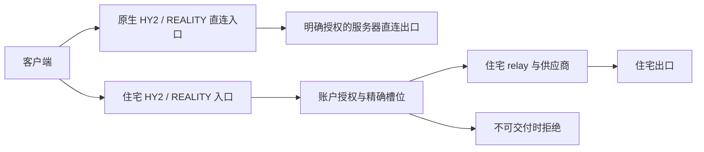

# 住宅出口契约（4.1.6）

BUI 的控制与管理仍由 Rust 实现；网络内核使用上游原版，sing-box 固定验证 1.14.2。住宅通路的承诺是：进入住宅入口的业务只使用声明的住宅供应商，无法交付时明确拒绝。独立直连权益只授权独立直连入口，不能作为住宅故障的逃生口。

## 授权和可交付状态

`bui-schema::egress::access_for` 是通路授权的唯一纯决策。它检查账户拒绝、协议及通路权益，再检查受支持分组、启用且非空的池、精确槽位与供应商引用、槽序号和住宅 HY2 凭据。授权消费者不调用 `fallback_index` 猜出口。当前数据面只支持 `default` 分组；其他组明确拒绝，不自动接入默认池。

静态凭据分配表达需求，不能随池暂时关闭而释放。健康故障后的借用仍只能发生在住宅供应商之间。门位、原生鉴权快照、Xray 启动配置和运行时两个入口、面板节点及订阅交付均消费这一授权决策。到期和配额仍使用已有统一账户判定，包含 daemon 内待落账流量；磁盘配置生成接收相同 State publication 的拒绝集合。

Xray 运行时同步先撤销，再新增；真正内核清单用于查找 daemon 重启后丢失本地记账的已删除身份。清单读取失败不代表收敛成功。BUI 客户端均使用 UUID email；人为加入的匿名 Xray 客户端不在该命名身份枚举的覆盖范围内。

Xray 路由同步失败时，重启许可必须同时核对当前账户授权和磁盘完整配置；槽规则摘要相同不能证明启动授权仍然有效。重启执行者持有同一 publication 和待落账流量边界直到动作返回，等待者取消不能提前释放它的写权。过期授权或未知磁盘身份使本轮延期，保持未收敛状态。

## 配置和交付行为

| 状态 | 住宅入口和 relay | 订阅接口 |
| --- | --- | --- |
| 有效授权、池与精确绑定 | 使用住宅供应商 | 交付授权节点 |
| 池停用、空池、坏绑定或不支持的组 | 拒绝住宅业务 | 有住宅权益的账户返回 503 |
| 账户禁用、到期或达到配额 | 拒绝账户业务 | 返回 403，不交付凭据 |
| HTTP 或混合池不支持 UDP | 拒绝住宅 UDP | 不改为直连身份 |
| 零节点完整配置 | 无条件拒绝业务 | 不生成本机 DIRECT 退路 |

当前订阅采用保守交付边界：账户有住宅权益时，将该需求保留到交付结束；无法兑现住宅需求就拒绝整份 feed，包括 URI feed，防止客户端在结构化接口失败后继续导入剩余直连节点。融合账户尚未配置住宅池时也会返回 503。新装默认账户有住宅权益，而住宅池初始停用且为空；需要先配置并启用住宅上游、完成出口绑定，再使用订阅。只需直连时，可以另建未勾选住宅权益的直连账户。现有编辑接口不支持取消已创建账户的住宅权益。安装摘要和建号界面明确披露这个交付条件。单独直连入口仍按直连授权判定。这是可见的行为变化，不是隐藏错误。

共享 relay 不携带用户身份，因此其内部不做账户级 direct/split 决策。旧 split 关键字只用于完整客户端配置在独立授权的两条入口之间选择。住宅 relay 的黑名单及初始目标能力限制产生拒绝；业务 DNS 经住宅供应商，供应商自身地址的 bootstrap 解析是单独的基础设施连接。

面板的单节点链接直接消费 Rust 后端生成的 URI，与订阅使用相同节点参数。网页不再拼接住宅端口、住宅凭据或伪装参数；住宅 HY2 新建及轮换后的保留身份会同时用于复制和二维码。不可交付账户不返回单节点 URI。

## 验证和边界

验证必须包含独立目标的完整 nonce、上传/响应字节、拒绝前后可达对照，以及把拒绝故意改成直连的突变。配置 check 只证明原版内核接受配置，不等于业务出口已验证。测试源需要与工作树摘要一致，不能以另一工作树或陈旧 Cargo 缓存冒充候选测试。

原版 sing-box 1.14.2 的 UDP 规则按 association 初始目标评估。同一 association 的后续目标可能不重新执行私网、端口或域名检查，但仍使用同一住宅供应商。本版本不宣称逐个 UDP 后续目标都完成 ACL，也不为此维护定制内核或新增 Rust 数据面。

URI 只交付节点参数，不能控制外部客户端自己的 TUN、DNS、IPv6 或已保存配置。BUI Linux 客户端的既有模板也有独立的本机路由策略，本轮没有将其等同于完整订阅模板验收。服务器契约保护进入服务器住宅通路的业务，不能单独证明所有客户端流量都进入隧道。

远端 `stream canceled ... code 0` 表示对端停止读取一条流，不足以证明请求完整、全隧道断开或 IP 泄露。原版内核半关闭的数据完整性边界仍须单独取证；Rust 控制面不能恢复已经被上游内核取消的字节。本版本不降低日志级别、不改变用户 Mac 配置，也不据这些错误认定第三方平台的封号原因。
