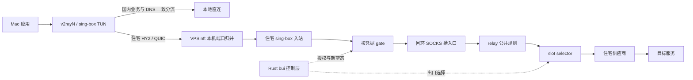

# Rust 架构与网络稳定性复核

日期：2026-09-29。审查基线：`e83a939`（v4.1.3 修复分支）。约束：继续使用 Rust；以真实业务路径和可重复故障为验收依据。

## 结论与证据等级

本次发现的是客户端分流遗漏、协议地址语义变化和多决策源的状态协调问题。Rust 控制进程不在应用数据的逐包转发路径上。不能把这些问题统称为语言性能问题，也不能用进程 active 或一条 Google 探针成功证明业务正常。

| 发现 | 证据 | 处置边界 |
|---|---|---|
| 国内云控制台的公共 CDN 依赖漏分流 | 浏览器资源耗时约 82/94 秒；公共资源经客户端代理超时、本机直连成功；补规则后确认实际 route=direct | 修正 Mac v2rayN 路由，不能宣称 URI 订阅会自动分发路由 |
| 本槽已健康、当前借用已坏，仍等三轮回切 | Rust 决策分支与回归测试 | 故障逃生优先于恢复防抖；当前仍健康时保留三轮要求 |
| 重启重放与手动/自动切换可交错，live 与 runtime 不一致 | 可暂停的 Clash 测试替身复现旧 PUT 覆盖新决定 | 同一互斥域覆盖快照、PUT、记录；健康探测不持有出口锁 |
| 主动 SOCKS 探测把 REP4 等瞬时失败视为策略拒绝 | 真实回环 SOCKS 握手进入真实 blacklist::confirm_once，旧行为返回 Some(true) | 与被动日志一致：只有 REP2 确认策略拒绝；其他失败保持未知 |
| 全局 selected 的上游专属策略污染其他槽 | 真实 Rust renderer + sing-box + 两个回环上游，三种错误均复现 | 需要策略随实际出口执行，静态按初始槽绑定只能修一半 |
| IP-only 请求不再恢复成域名交给住宅上游 | 真实 sing-box 1.14.2，SNI/Host 已嗅出，但上游收到 ATYP1；原本为域名则 ATYP3 | 优先保持客户端 DNS 与路由一致；不添加内核不支持的 JSON 字段 |

控制层的代码可达缺陷与数据面回环实验，不等于已逐条归因线上所有卡顿。线上一个六分钟窗口有 148 条 SOCKS REP4，约 15–16 秒后失败，而基准上游探针正常；只有部分目标与客户端 DNS 得到了对应。QUIC code0 也不能与这些错误仅按时间或 stream 编号配对。

## 实际拓扑

v3 已存在本机 SOCKS relay。v4/v4.1 除了语言迁移，还改变了住宅入口内核、凭据生命周期、多槽借用、UDP 策略与域名处理。优化要逐项核对语义，不能只根据“多一层”推断瓶颈。

Mac 的 v2rayN 使用节点 URI 订阅，URI 不携带完整 DNS/分流策略。`bui-c` 与完整 sing-box 配置中的国内规则不会因此自动进入 v2rayN。客户端策略与服务端策略是两个明确的交付边界。

## 本轮控制层修复的约束

### 出口写入串行化

住宅 relay 的 drive、borrow、pin、手动全局选择、自动全局选择和重启重放必须共享同一出口控制锁。读取用于选择的状态必须发生在拿锁以后；只给 runtime 写回加 CAS 不能保护内核已经被旧 PUT 覆盖。

锁顺序固定为：出口锁 → 短时间读取 store/runtime → Clash 请求 → 写入 runtime。探测、测速等慢任务在锁外。全局健康决策在按槽驱动结束后重新拿锁、重新读取状态，避免嵌套锁和过期快照。

不扩大门控动作：住宅 HY2 的 gate 属于另一内核的授权控制；到期/封禁会有意中断对应凭据的连接。relay selector 继续设置 `interrupt_exist_connections:false`，普通出口切换让旧连接自然结束。

### 故障逃生与恢复防抖分离

本槽出口已经满足健康条件时：

- 当前借用仍健康：继续三轮恢复防抖。
- 当前借用已不健康、Google 不可用或已不在池内：立即返回已健康的本槽。
- 人工 pin：保留人工优先级，不悄悄推翻用户选择。
- 全部不可用或 PUT 失败：不虚报切换成功，不把 runtime 改成未实际落地的目标。

### 失败分类与策略学习分离

SOCKS5 REP2 表示规则拒绝；REP4 表示目标不可达；其他回复可能是网络故障、目标拒绝、TTL 或协议能力问题。主动探测不能把所有非零 REP 都作为长期绕行策略的确认依据。

本轮保留现有四类探测接口，非策略错误放入 `Unreachable` 并保留 REP 值。它对 blacklist 的含义是“未知，不推进确认，也不累计恢复通过”。HTTP CONNECT 的现有分类属于另一个待审查边界，本轮未泛化修改。

## 后续拓扑优化：策略属于实际出口

当前端口能力与自动黑名单取自 `state.selected_upstream_id`，实际选择却来自 runtime 与 Clash，且每槽不同。这三个身份不能继续混用。

已验证的合成案例：

1. A 只允许 80/443，B 允许另一端口；B 槽请求该端口却被 A 的规则送去 direct。
2. A 的 `a-block.example` 自动规则把 B 槽也送去 direct。
3. B 的 `b-block.example` 规则未渲染，B 槽仍走住宅失败路径。
4. 仅按初始槽加 inbound 条件，热借用 B→A 后，规则仍属于 B，故仍错误。

候选方案是由 Rust 渲染每个上游固定的策略入口：slot selector 选择一个回环 SOCKS policy endpoint，该入口执行同一上游的专属规则后进入真实供应商。两上游回环原型的五项选路用例已通过。

这还是原型，未改生产 renderer。上线前必须解决：新增 SOCKS/UDP association 成本、失败日志的稳定 UUID 与原槽归因、HTTP/SOCKS 混池 UDP、私网保护、长流切换及删除上游时的标识重排。不能用每次借用重渲染整个 relay 来替代：当前配置变更会重启全池。

若进一步要求改规则、增删上游也不中断旧连接，应把变化配置放入独立 backend 代际，由 Rust 完成“渲染与 check → 启动与路径验证 → 新流切换 → 旧流排空”。同一 sing-box 进程没有通用配置热更新 API；一个额外本机代理层也不是免费优化。先测量常驻资源与吞吐，再决定部署形态。

## 仍未解决的观测与协调边界

- `/api/health.status` 目前是服务/对账状态；住宅探测只验证 VPS→供应商→基准站点。它们不能代表 Mac→HY2→gate→slot→实际目的地。
- 目标路径失败必须独立观测。REP4 既不应沉默，也不应直接触发整池切换或永久直连。记录错误类别、耗时、实际出口 UUID、配置代际，再做同目标跨路径对照。
- 自动与人工健康巡检尚需合并为 single-flight；样本需要时间/代际约束，避免旧探测覆盖更新观察。这与出口 PUT 互斥是两个问题。
- 当前 UDP 路由按 SOCKS5 类型启用，STUN 结果主要用于排序。TCP 探针健康不能证明该槽 UDP/QUIC 可用；变更前需要实际 UDP 会话证据。
- 新增/删除上游、策略变更仍可能重启 relay。运维报告应检查启动时间与 journal，而不是仅看 `NRestarts`；后者不能统计所有主动重启。
- 单条 code0 常见于对端结束某个流。62/112 秒是日志中的连接年龄；没有证据表明存在同值的故障计时器，不能据此盲调 keepalive 或 idle timeout。

## 验收

本轮 Rust 修复先跑失败回归，再跑 Linux 全工作区测试、clippy、fmt 和真实内核配置校验。Linux 目标依赖 inotify，macOS 原生 `cargo test -p bui` 的平台编译错误不能算回归测试结果；使用断网 Linux 容器和已缓存内核验证。

部署控制进程时验证住宅内核和 relay 的 PID/启动时间、配置摘要、实际 selector 与 runtime 一致，并保留回滚。客户端验证包括受影响 CDN 的真实 route 和下载结果；用户随后确认登录后的阿里云“费用与成本”页面已经正常打开。补规则后的压缩资源请求：tracker 三次 0.12–0.15 秒，footer 三次 0.06–0.19 秒，费用应用脚本 0.16 秒，首页组件 0.77 秒。不能用公开登录页 HTTP200 替代登录后业务验收。

协议参考：[RFC1928 §6](https://www.rfc-editor.org/rfc/rfc1928.html#section-6)、[sing-box 1.14.2 route action 定义](https://github.com/SagerNet/sing-box/blob/v1.14.2/option/rule_action.go)、[sing-box 路由动作](https://sing-box.sagernet.org/configuration/route/rule_action/)。

本轮本地 Linux 全工作区结果：1931 项通过、0 失败、3 项按原设计忽略。真实默认内核为 sing-box 1.14.2、Xray 26.3.27、Hysteria 2.12.3、Caddy 2.11.4；1.12/1.13 的额外别名未装，本机不声称已覆盖两旧版本。第一次全量执行发现容器内 Caddy 可执行位缺失，第二次发现旧缓存内嵌 fixture 路径为 /app；修复容器路径/权限后完整重跑通过，未修改测试 fixture 或放宽断言。
